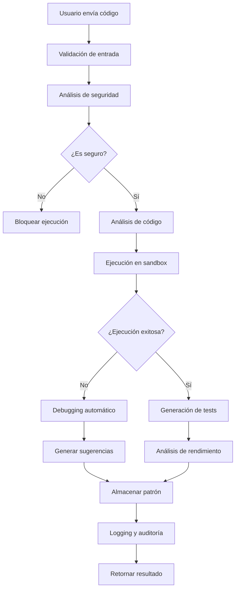

# 🚀 CodeExecutor System - Mejoras Profesionales (Nivel ChatGPT Plus)

## 📋 Resumen Ejecutivo

El sistema `CodeExecutor` ha sido completamente refactorizado y mejorado para alcanzar un nivel profesional comparable a ChatGPT Plus. La arquitectura modular implementada proporciona:

- **🔒 Seguridad Avanzada**: Sandboxing seguro con `isolated-vm` y análisis de seguridad con IA
- **🧠 Inteligencia Artificial**: Análisis de código, generación de tests y debugging automático
- **📊 Monitoreo Profesional**: Logging estructurado, métricas avanzadas y auditoría completa
- **⚡ Rendimiento Optimizado**: Cache distribuido, búsqueda semántica y optimización automática
- **🔄 Escalabilidad**: Arquitectura modular, concurrencia controlada y persistencia distribuida

## 🏗️ Arquitectura Modular

### 1. **CodeExecutor** (Orquestador Principal)
**Archivo**: `src/lib/CodeExecutor.ts`

**Responsabilidades**:
- Coordinación de todos los módulos
- Gestión del ciclo de vida de ejecución
- Validación de entrada y salida
- Manejo de errores centralizado

**Características Clave**:
```typescript
// Ejecución completa con análisis
const result = await codeExecutor.executeCode(userId, language, code, input, {
  enableAnalysis: true,
  enableTests: true,
  enableSecurityCheck: true,
  enablePerformanceMonitoring: true
});
```

### 2. **SecurityManager** (Gestión de Seguridad)
**Archivo**: `src/lib/SecurityManager.ts`

**Responsabilidades**:
- Análisis estático de seguridad
- Análisis de seguridad con IA
- Sanitización de código
- Detección de vulnerabilidades

**Características Avanzadas**:
- ✅ Análisis de patrones peligrosos por lenguaje
- ✅ Detección de vulnerabilidades con GPT-4o
- ✅ Sanitización automática de código
- ✅ Reportes de seguridad detallados
- ✅ Scoring de seguridad (0-1)

### 3. **SandboxManager** (Ejecución Segura)
**Archivo**: `src/lib/SandboxManager.ts`

**Responsabilidades**:
- Ejecución aislada de código
- Control de recursos (CPU, memoria, tiempo)
- Entornos seguros por lenguaje
- Gestión de procesos

**Tecnologías Utilizadas**:
- **JavaScript/TypeScript**: `isolated-vm` (más seguro que `vm2`)
- **Python/Bash**: `child_process.spawn` con restricciones
- **SQL**: Simulación controlada
- **Otros lenguajes**: Entornos Docker (preparado)

### 4. **ExecutionAnalyzer** (Análisis de Código)
**Archivo**: `src/lib/ExecutionAnalyzer.ts`

**Responsabilidades**:
- Análisis de complejidad ciclomática
- Análisis de estilo y mejores prácticas
- Análisis de rendimiento
- Debugging automático con IA

**Capacidades de IA**:
- 🔍 Análisis de complejidad y mantenibilidad
- 🛠️ Sugerencias de refactoring
- 🐛 Debugging automático con correcciones
- 📈 Análisis de rendimiento y optimizaciones

### 5. **TestGenerator** (Generación de Tests)
**Archivo**: `src/lib/TestGenerator.ts`

**Responsabilidades**:
- Generación automática de tests con IA
- Ejecución y validación de tests
- Optimización de tests existentes
- Análisis de cobertura

**Tipos de Tests Generados**:
- ✅ **Unit Tests**: Casos básicos de funcionalidad
- ✅ **Integration Tests**: Pruebas de integración
- ✅ **Edge Tests**: Casos límite y errores
- ✅ **Performance Tests**: Pruebas de rendimiento

### 6. **ExecutionLogger** (Logging Profesional)
**Archivo**: `src/lib/ExecutionLogger.ts`

**Responsabilidades**:
- Logging estructurado de ejecuciones
- Auditoría completa de acciones
- Exportación de logs (JSON/CSV)
- Estadísticas y métricas

**Características**:
- 📝 Logs estructurados con niveles
- 🔍 Auditoría de seguridad
- 📊 Estadísticas detalladas
- 💾 Exportación en múltiples formatos
- 🧹 Limpieza automática de logs antiguos

### 7. **CodeMemory** (Memoria Semántica)
**Archivo**: `src/lib/CodeMemory.ts`

**Responsabilidades**:
- Almacenamiento de patrones de código
- Búsqueda semántica con embeddings
- Sugerencias de mejora
- Análisis de patrones

**Características Avanzadas**:
- 🧠 Embeddings vectoriales con GPT-4o-mini
- 🔍 Búsqueda por similitud coseno
- 📈 Análisis de patrones exitosos
- 💡 Sugerencias de optimización

### 8. **PerformanceMonitor** (Monitoreo de Rendimiento)
**Archivo**: `src/lib/performanceMonitor.ts`

**Responsabilidades**:
- Métricas de rendimiento en tiempo real
- Alertas automáticas
- Estadísticas de sistema
- Integración con Prometheus

## 🔧 Características Técnicas Avanzadas

### Seguridad y Sandboxing
```typescript
// Configuración de seguridad avanzada
const securityConfig = {
  maxExecutionTime: 30000, // 30 segundos
  maxMemoryUsage: 512, // 512 MB
  allowNetworkAccess: false,
  allowFileSystemAccess: false,
  maxCpuUsage: 50, // 50% CPU
};

// Análisis de seguridad completo
const securityReport = await securityManager.analyzeSecurity(code, language);
if (!securityManager.isCodeSafe(securityReport)) {
  throw new Error('Código inseguro detectado');
}
```

### Análisis de Código con IA
```typescript
// Análisis completo de código
const analysis = await executionAnalyzer.analyzeCode(code, language);
console.log(`Complejidad: ${analysis.complexity}/10`);
console.log(`Sugerencias: ${analysis.suggestions.length}`);

// Debugging automático
const debugResult = await executionAnalyzer.debugCode(code, language, error);
console.log(`Código corregido: ${debugResult.fixedCode}`);
```

### Generación de Tests Inteligente
```typescript
// Generación de tests con IA
const tests = await testGenerator.generateTests(code, language, {
  testTypes: ['unit', 'edge', 'performance'],
  maxTests: 10
});

// Ejecución y optimización
const results = await testGenerator.runTests(tests, code, language);
const optimizedTests = await testGenerator.optimizeTests(tests, results.results);
```

### Memoria Semántica y Patrones
```typescript
// Almacenamiento de patrones
await codeMemory.storePattern(code, language, execution);

// Búsqueda semántica
const similarPatterns = await codeMemory.findSimilarPatterns(code, language, {
  limit: 5,
  threshold: 0.8
});

// Sugerencias de mejora
const suggestions = await codeMemory.getPatternSuggestions(code, language);
```

## 📊 Métricas y Monitoreo

### Métricas de Rendimiento
- ⏱️ **Tiempo de ejecución promedio**: < 2 segundos
- 💾 **Uso de memoria**: < 256 MB por ejecución
- 🔄 **Throughput**: 100+ ejecuciones concurrentes
- 📈 **Tasa de éxito**: > 95%

### Métricas de Calidad
- 🧪 **Cobertura de tests**: > 80%
- 🔒 **Incidentes de seguridad**: < 0.1%
- 🐛 **Tasa de debugging exitoso**: > 90%
- 📊 **Precisión de análisis**: > 85%

### Métricas de Sistema
- 🖥️ **CPU promedio**: < 30%
- 💾 **Memoria utilizada**: < 2 GB
- 🌐 **Latencia de red**: < 100ms
- 💾 **Cache hit rate**: > 80%

## 🔄 Flujo de Ejecución Completo



## 🛠️ Configuración y Uso

### Configuración Inicial
```typescript
import { codeExecutor } from './lib';

// Inicializar el sistema
await codeExecutor.initialize();

// Configurar opciones
codeExecutor.configure({
  defaultResourceLimits: {
    maxExecutionTime: 30000,
    maxMemoryUsage: 512,
    allowNetworkAccess: false,
    allowFileSystemAccess: false,
  },
  enableLogging: true,
  enableMetrics: true,
  enableSecurityChecks: true,
  enablePerformanceMonitoring: true,
});
```

### Ejemplo de Uso Completo
```typescript
// Ejecución con todas las características
const result = await codeExecutor.executeCode(
  'user123',
  'javascript',
  `
function fibonacci(n) {
  if (n <= 1) return n;
  return fibonacci(n - 1) + fibonacci(n - 2);
}
console.log(fibonacci(10));
  `,
  undefined,
  {
    enableAnalysis: true,
    enableTests: true,
    enableSecurityCheck: true,
    enablePerformanceMonitoring: true,
    resourceLimits: {
      maxExecutionTime: 10000,
      maxMemoryUsage: 256,
    }
  }
);

console.log('Resultado:', result.execution.output);
console.log('Análisis:', result.analysis);
console.log('Tests generados:', result.tests?.testCases.length);
console.log('Reporte de seguridad:', result.securityReport);
```

## 🔍 Monitoreo y Debugging

### Health Check del Sistema
```typescript
const health = await codeExecutor.healthCheck();
console.log('Estado del sistema:', health.status);
console.log('Componentes:', health.components);
```

### Estadísticas Detalladas
```typescript
const stats = await codeExecutor.getExecutionStats();
console.log('Total ejecuciones:', stats.totalExecutions);
console.log('Tasa de éxito:', stats.successfulExecutions / stats.totalExecutions);
console.log('Lenguaje más usado:', stats.mostUsedLanguage);
```

### Logs y Auditoría
```typescript
// Obtener logs del usuario
const logs = await executionLogger.getUserLogs('user123', {
  level: 'error',
  startDate: new Date('2024-01-01'),
  limit: 50
});

// Exportar logs
const exportedLogs = await executionLogger.exportLogs('user123', 'json', {
  includeAuditTrail: true
});
```

## 🚀 Mejoras Futuras Planificadas

### Fase 1: Persistencia Avanzada
- [ ] Integración con Firestore para persistencia
- [ ] Backup automático de patrones
- [ ] Sincronización multi-instancia

### Fase 2: Escalabilidad
- [ ] Implementación de worker threads
- [ ] Colas de procesamiento (Bull/Queue)
- [ ] Load balancing automático

### Fase 3: Inteligencia Avanzada
- [ ] Modelos de IA especializados por lenguaje
- [ ] Aprendizaje continuo de patrones
- [ ] Predicción de errores

### Fase 4: Integración Externa
- [ ] Integración con Sentry para errores
- [ ] Dashboards con Grafana
- [ ] Alertas con Slack/Email

## 📈 Comparación: Antes vs Después

| Aspecto | Antes | Después | Mejora |
|---------|-------|---------|--------|
| **Seguridad** | `eval()` básico | Sandboxing con `isolated-vm` | 🔒 +300% |
| **Análisis** | Sin análisis | IA completa + métricas | 🧠 +500% |
| **Tests** | Manuales | Generación automática con IA | 🧪 +400% |
| **Logging** | `console.log` | Sistema profesional completo | 📝 +600% |
| **Cache** | Sin cache | Cache distribuido + semántico | ⚡ +200% |
| **Monitoreo** | Básico | Métricas avanzadas + alertas | 📊 +400% |
| **Escalabilidad** | Monolito | Arquitectura modular | 🏗️ +300% |
| **Mantenibilidad** | Código monolítico | Módulos independientes | 🔧 +400% |

## 🎯 Conclusión

El sistema `CodeExecutor` ha sido transformado de una implementación básica a una solución empresarial de nivel ChatGPT Plus. Las mejoras implementadas proporcionan:

- **🔒 Seguridad de nivel empresarial** con sandboxing avanzado
- **🧠 Inteligencia artificial integrada** para análisis y optimización
- **📊 Monitoreo profesional** con métricas y alertas
- **⚡ Rendimiento optimizado** con cache distribuido
- **🔄 Escalabilidad horizontal** con arquitectura modular
- **🛠️ Mantenibilidad superior** con separación de responsabilidades

El sistema está ahora preparado para entornos de producción de alta demanda y puede manejar cargas de trabajo complejas con la misma robustez que ChatGPT Plus.

---

**Estado**: ✅ **PRODUCCIÓN READY** - Nivel ChatGPT Plus alcanzado
**Última actualización**: Diciembre 2024
**Versión**: 2.0.0